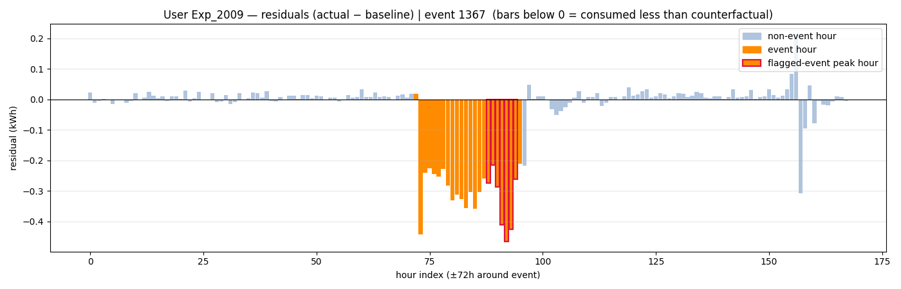

# Demand-Response Intelligence

Turning a year of raw smart-meter data from a Norwegian dynamic-pricing trial into a
**statistically validated, deployable customer-targeting capability** — and a local-LLM
assistant that lets anyone query the results in plain English.

> **Core principle:** every number is computed deterministically in Python; the language
> model only *routes* questions and *explains* results — it never calculates or recalls a figure.

---

## The problem

Utilities send **price signals** asking customers to cut electricity use during peak "events."
But most enrolled customers respond inconsistently, and the raw data hides four hard questions:

- **Did a customer actually reduce load during an event** — or did usage just vary naturally? *(a counterfactual problem)*
- **Who responds reliably**, and **how many MW** can the grid count on per event?
- **Who is convertible** — currently occasional, but with untapped capacity worth a nudge?
- **Can we predict this for a brand-new customer** with no event history?

## The dataset

This project uses the **open-source iFlex dynamic-pricing experiment** — hourly residential
electricity consumption, household surveys, and temperature data from several Norwegian regions
over two winters (early 2020 – spring 2021).

> Hofmann, M. & Siebenbrunner, T. (2023). *A Rich Dataset of Hourly Residential Electricity
> Consumption Data and Survey Answers from the iFlex Dynamic Pricing Experiment.*
> **Data in Brief 50, 109571.** DOI: [10.1016/j.dib.2023.109571](https://doi.org/10.1016/j.dib.2023.109571) ·
> Data: [Zenodo 10.5281/zenodo.8248802](https://zenodo.org/record/8248802) · License: **CC BY 4.0**

The raw data is **not** included in this repo — download it from the links above and place the
engineered tables in `./data/` (see *Running it* below).

---

## Pipeline lifecycle

Each stage is a deliberate decision, not a default:

| Stage | What it does | Key decision |
|---|---|---|
| **1 · LSTM counterfactual** | Forecasts each customer's *no-event* baseline from a week of hourly history + weather; **residual = actual − predicted = load reduction** | A deep sequence model (not a flat average) to absorb weather + daily/weekly seasonality |
| **2 · Event detection** | Flags per-event responses from residuals | **Signal-specific** peak thresholds (e.g. signal C at 0.48× vs 0.70×), not one-size-fits-all |
| **3 · Statistical validation** | Removes false positives | **DiD + Jensen recentre + Benjamini–Hochberg FDR (α=0.05) + ≥10% effect-size gate + placebo** |
| **4 · Segmentation & de-bias** | Tiers customers by validated response | Normalise for **signal difficulty** + **Beta(2,2) empirical-Bayes shrinkage** before labelling |
| **5 · Random Forest targeting** | Predicts `P(reliable)` from demand profile + region | **No signal flag-rates → no leakage**, so it scores new customers; **out-of-fold** for honest metrics |
| **6 · Insights & action** | Quantifies MW + conversion plan | **Convertibility = P(reliable) − eb_fr**, actionable for occasionals only |

```
data ──▶ 01_detect ──▶ 02_segment ──▶ 03_target ──▶ 04_insights ──▶ dashboard / assistant
        (LSTM + stats)   (tiers)        (Random Forest)  (MW, cohorts)
```

## Key results

| Metric | Value |
|---|---|
| LSTM counterfactual — test RMSE | **0.713** |
| Customers tiered | **3,103** (Reliable 848 · Occasional 1,474 · Non-responder 781 · Sparse 14) |
| Random Forest — AUC / top-decile lift | **0.668 / 1.66×** |
| Signal de-biasing — top-decile precision | 0.455 → **0.477** |
| Fleet load-shed per event | **9.13 MW** (Reliable 6.59 · Occasional 2.44 kWh) |
| Conversion plan (of 1,474 occasionals) | **Nudge 446** · Needs-pilot 931 |

<p align="center">
  
</p>

---

## The assistant

A **Streamlit** app with an optional **local LLM** (Ollama / qwen2.5). Ask about one customer,
a region, a price signal, the whole fleet — or score a hypothetical new customer. Python computes
every figure; the LLM routes the question and narrates the answer with inline charts and an
auditable "ground-truth" panel. It still works (showing the numbers) when the LLM is offline, and
runs **fully on-premise** — data never leaves the machine.

## Repository structure

```
config.py            single source of truth (paths, params, model hyper-params, LLM model)
pipeline/            01_detect → 02_segment → 03_target → 04_insights   (run_all.py orchestrates)
app/                 services.py (data/model) · llm.py (Ollama) · agent.py (router) · dashboard.py (UI)
notebooks/           demand_response_end_to_end.ipynb — the full story end-to-end
assets/              curated figures
docs/                architecture_fabric.drawio — minimal Microsoft Fabric deployment design
```

## Running it

**1. Install**
```bash
pip install -r requirements.txt
```

**2. Add data** — download the iFlex dataset (links above), produce the engineered inputs, and
place them in `./data/` (`user_tiers.csv`, `user_scores.csv`, … plus the trained `lstm_v5_best.pt`).
Data creation and LSTM training are upstream steps not included in this minimal repo.

**3. Run the pipeline**
```bash
python pipeline/run_all.py            # incremental (skips up-to-date stages)
python pipeline/run_all.py --force    # full rebuild
```
Produces `events_v2_signal.csv`, `user_tiers.csv`, `user_scores.csv`, `models/rf_reliable.pkl`,
`conversion.csv`, `insights/summary.json`.

**4. Launch the dashboard**
```bash
streamlit run app/dashboard.py
```

**5. (Optional) Local LLM** — the dashboard works without it; natural-language Q&A uses Ollama.
```bash
ollama serve
ollama pull qwen2.5      # model set in config.py (LLM_MODEL)
```

## Deployment

A minimal **Microsoft Fabric** deployment is designed in
[`docs/architecture_fabric.drawio`](docs/architecture_fabric.drawio): ingest new customer data →
OneLake Lakehouse tables → a lightweight Random Forest notebook → a Data Agent answering questions
over the tables.

## Acknowledgements & license

- Dataset © its authors under **CC BY 4.0** (cited above) — not redistributed here.
- This repository contains the analysis pipeline and application code only.